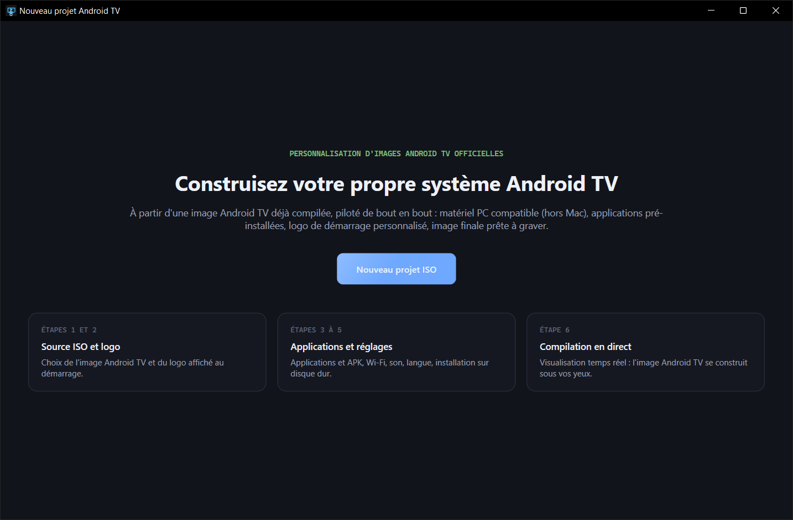

  

 

Technicien informatique indépendant à Boulogne-sur-Mer depuis 2021, je répare des PC, des consoles, des téléviseurs et des smartphones. Et quand un outil me manque à l'atelier, **je le développe**. Chaque logiciel commence par une panne réelle ; il n'est terminé que lorsqu'un client peut s'en servir sans moi.

 

## 📺 Logiciel phare

<table>
<tr>
<td width="55%" valign="top">

</td>
<td width="45%" valign="top">

### AndroidTvPcIsoBuilder

**Un vieux PC devient un boîtier Android TV.**

Choisissez une image Android TV, ajoutez vos applications, votre Wi-Fi et votre logo : le logiciel crée une clé USB qui démarre directement sur votre logo, puis sur l'accueil Android TV, sans aucun menu.

- 🎬 Démarrage sans menu, logo animé
- 📦 VLC, Kodi, SmartTube en un clic
- 📡 Wi-Fi, français et AZERTY réglés d'avance
- 💾 Clé USB avec mémoire persistante

Windows 10 / 11 · installeur ou portable

</td>
</tr>
</table>

 

## 🧰 La suite atelier

Treize petits utilitaires réunis en trois logiciels cohérents, actuellement réécrits dans la même qualité qu'AndroidTvPcIsoBuilder.

<table>
<tr>
<td width="33%" align="center"></td>
<td width="33%" align="center"></td>
<td width="33%" align="center"></td>
</tr>
</table>

 

## 🔧 Outils spécialisés

| Logiciel | À quoi il sert | État |
|---|---|:---:|
| **[WinForge Studio](https://github.com/lerapeurdu62280-debug/WinForgeStudio)** | Construit des ISO Windows sur mesure : applications superflues retirées, pilotes injectés, installation automatisée | En développement |
| **T-CON Master Pro** | Diagnostic et réparation des cartes T-CON de téléviseurs, base de cartes, export PDF et Excel | Usage atelier |
| **RepairPost Studio** | Rédige les publications Facebook de l'atelier à partir d'une veille d'actualités tech | Usage atelier |

<b>🧪 Laboratoire web</b> : petits outils en ligne, gratuits

 

- **[AudioTech ToolKit](https://lerapeurdu62280-debug.github.io/AudioTech_ToolKit/)** : diagnostic d'amplificateurs audio
- **[SecurePass Pro](https://lerapeurdu62280-debug.github.io/SecurePass-Pro/)** : générateur de mots de passe robustes
- **[Neon Snake](https://lerapeurdu62280-debug.github.io/Neon-Snake/)** : jeu d'arcade rétro

 

## 🛠️ Savoir-faire

<table>
<tr>
<td width="50%" valign="top">

**À l'atelier**
- Réparation de PC, portables, consoles, téléviseurs, smartphones
- Récupération de données (NTFS, FAT32, carving)
- Sécurisation et maintenance de postes
- Démarche éco-responsable **Répar'acteurs**

</td>
<td width="50%" valign="top">

**Au clavier**

</td>
</tr>
</table>

 

---

**S.O.S INFO LUDO** · Ludovic Tourniquet · 19 rue Leuliette, 62200 Boulogne-sur-Mer · 06 59 59 05 15

Logiciels propriétaires, tous droits réservés. Android et Android TV sont des marques de Google LLC ; Windows est une marque de Microsoft Corporation.

